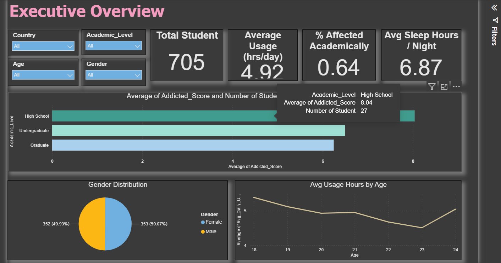
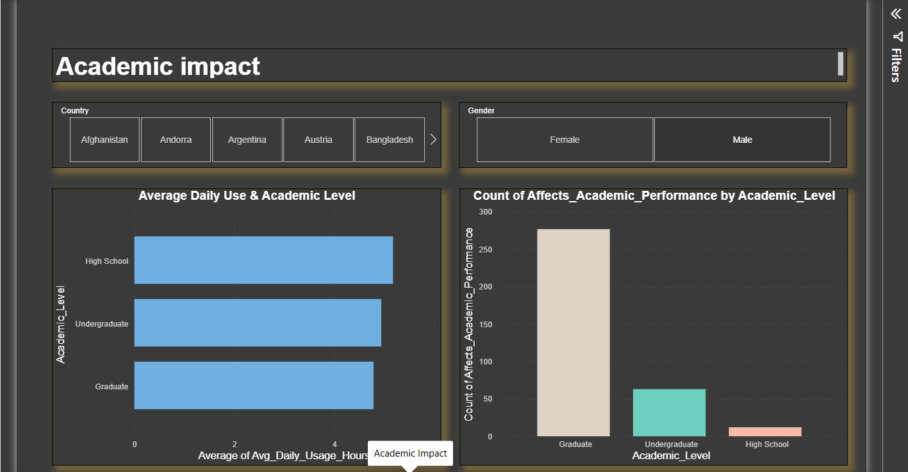
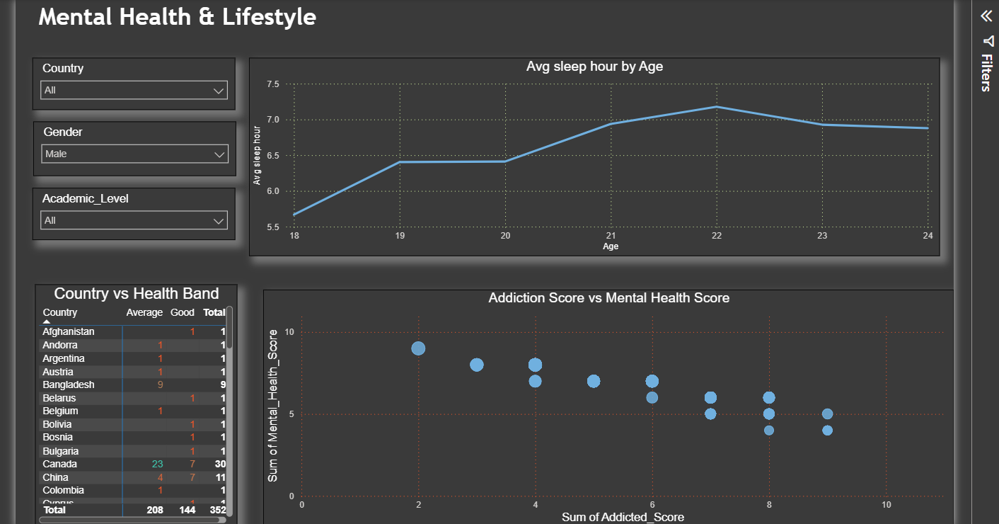
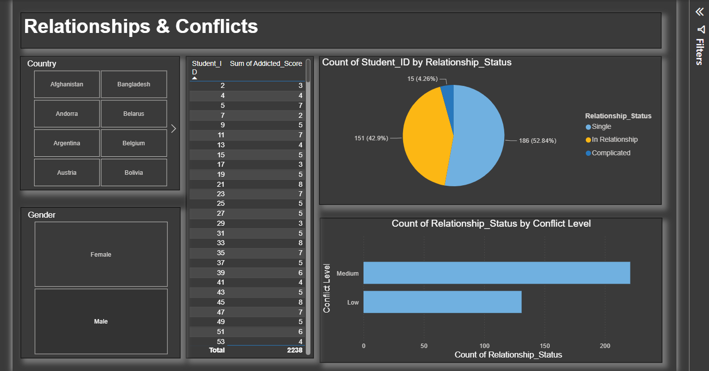
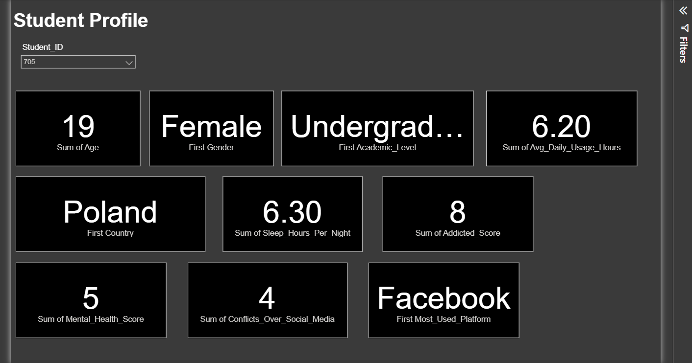

# Social Media Usage, Mental Health & Academic Performance Analysis

## Project Overview

This project analyzes the relationship between social media usage, mental health, sleep patterns, lifestyle factors, and academic performance among students.

The analysis was developed using Power BI to transform student-level data into an interactive dashboard that helps identify patterns, relationships, and potential areas of concern.

---

## Project Objectives

The main objectives of this analysis are:

- Analyze student social media usage patterns.
- Understand the relationship between social media usage and mental health.
- Analyze sleep patterns and lifestyle factors.
- Examine academic performance across different student groups.
- Identify patterns and relationships between lifestyle and academic outcomes.
- Present the findings through an interactive Power BI dashboard.

---

## Tools & Technologies

- **Power BI**
- **Power Query**
- **Data Cleaning & Transformation**
- **Data Visualization**
- **Data Analysis**

---
## Analogical Process

1. Data Collection
2. Data Cleaning & Transformation
3. Data Modeling
4. KPIs
5. Exploratory Analysis
6. Dashboard Development
7. Insight Generation
---
## Analysis Approach

The project follows a structured data analysis workflow:

- Cleaned and transformed the dataset using Power Query.
- Developed KPIs to monitor key indicators.
- Used interactive filters for demographic and academic analysis.
- Designed multiple Power BI dashboard pages.
- Analyzed relationships between social media usage, lifestyle, mental health and academic performance.
---
## Dashboard

The project dashboard contains multiple analytical views covering:

- Executive Overview
- Mental Health & Lifestyle
- Academic Performance
- Relationships & Conflicts
- Student profile

### Executive Overview



### Academic Impact



### Mental Health & Lifestyle



### Relationships & Conflicts



### Student Profile



---

## 📁 Power BI Report

The complete Power BI report file is available in this repository.

📥 **[Download the Power BI Report](PowerBI/Social_Media_Usage_Mental_Health_Analysis.pbix)**

The report contains the Power Query transformations, data model, KPIs, interactive filters and dashboard pages used for this analysis.

---

## Key Areas of Analysis

### Social Media Usage

Analysis of students' social media usage patterns and their relationship with other lifestyle factors.

### Mental Health & Lifestyle

Analysis of mental health indicators, sleep patterns, and lifestyle-related factors.

### Academic Performance

Analysis of academic performance and how it varies across different student characteristics and behavioral patterns.

### Relationships & Conflicts

Analysis of relationships and potential conflicts associated with social media usage and student wellbeing.

---

## Key Insights

The dashboard was created to identify important patterns and relationships within the dataset.

Key findings from the analysis include:

- The dataset contains 705 students.
- Average social media usage is 4.92 hours per day.
- Average reported sleep duration is 6.87 hours per night.
- Academic impact varies across academic levels.
- Social media usage, sleep, mental health and academic performance show different patterns across student groups.


---
## Project Purpose

This project was developed as part of my Data Analyst portfolio to demonstrate my ability to analyze data, identify meaningful patterns, and communicate analytical findings through an interactive dashboard.

---
## Dataset

The dataset contains student-level information used to analyze social media usage, mental health, lifestyle factors and academic impact.

The dataset used for this project is available in the `Dataset` folder.

[View Dataset](Dataset/student_wellbeing_dataset.csv)

---
## Author

Debasish Mandal

Aspiring Data Analyst | Excel | SQL | Python | Power BI

---
## Project Structure

```text
social-media-student-wellbeing-analysis/
│
├── Dashboard/
│   └── Power BI dashboard screenshots
│
└── README.md


